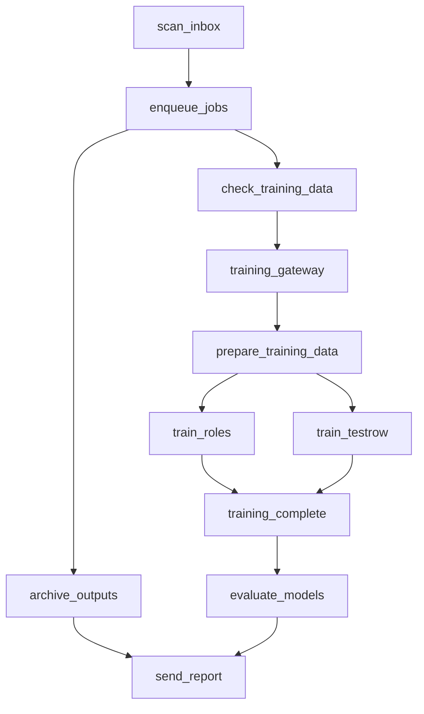

# Lab AI Orchestrator - Apache Airflow

Orchestrates the complete Lab AI processing pipeline with automated batch processing, model training, and evaluation workflows.

## 🏗️ Architecture

### Services Overview
- **airflow-postgres**: Metadata database for Airflow state
- **airflow-init**: One-time database initialization and user creation  
- **airflow-webserver**: Web UI for monitoring and managing workflows
- **airflow-scheduler**: Core scheduler for executing DAGs
- **redis**: Used by other Lab AI services (shared dependency)

### Pipeline Workflows

**Main Pipeline (`lab_pipeline`)** - Runs hourly:
1. **scan_inbox**: Find new PDFs in `/data/inbox/`
2. **enqueue_jobs**: Submit jobs to Lab AI API
3. **archive_outputs**: Clean up old processed files
4. **send_report**: Pipeline execution summary

**Weekly Training (`lab_pipeline_weekly_training`)** - Runs Sundays:
1. **check_training_data**: Look for new labeled data
2. **prepare_training_data**: Convert Label Studio exports
3. **train_roles** & **train_testrow**: Train ML models in parallel
4. **evaluate_models**: Test model performance
5. **send_training_report**: Training results summary

## 🐳 Docker Setup

### ARM64/M1 Compatibility

All services use `platform: linux/arm64` for Apple Silicon compatibility:

```yaml
services:
  airflow-webserver:
    image: apache/airflow:2.8.1
    platform: linux/arm64  # ← ARM64/M1 compatible
```

### Environment Variables

Key environment variables configured in docker-compose:

```yaml
environment:
  - AIRFLOW__CORE__EXECUTOR=LocalExecutor
  - AIRFLOW__CORE__LOAD_EXAMPLES=false
  - API_URL=http://api:8000
  - DATA_DIR=/data
  - MODELS_DIR=/models
```

### Volume Mounts

```yaml
volumes:
  - ./orchestrator/dags:/opt/airflow/dags          # DAG definitions
  - ./orchestrator/plugins:/opt/airflow/plugins    # Custom plugins
  - ./orchestrator/config:/opt/airflow/config      # Configuration
  - ./data:/data                                   # Data directory
  - ./models:/models                               # ML models
  - ./scripts:/scripts                             # Converter scripts
  - ./services:/services                           # Training services
```

## 🚀 Running Airflow

### Start Services

**Option 1: Full system with Airflow**
```bash
# Start all services including Airflow
docker-compose --profile airflow up -d

# Or start everything
docker-compose --profile airflow --profile monitoring up -d
```

**Option 2: Airflow only**
```bash
# Start just Airflow services
docker-compose up airflow-postgres airflow-init airflow-webserver airflow-scheduler -d
```

### ARM64/M1 Run Steps

1. **Ensure Docker Desktop** is configured for ARM64:
   ```bash
   docker version --format '{{.Server.Arch}}'
   # Should show: arm64
   ```

2. **Start PostgreSQL first** (dependency):
   ```bash
   docker-compose up airflow-postgres -d
   # Wait for healthy status
   docker-compose ps airflow-postgres
   ```

3. **Initialize Airflow database**:
   ```bash
   docker-compose up airflow-init
   # Wait for completion (creates admin user)
   ```

4. **Start core services**:
   ```bash
   docker-compose up airflow-webserver airflow-scheduler -d
   ```

5. **Verify services**:
   ```bash
   # Check all services are healthy
   docker-compose ps
   
   # Check logs if needed
   docker-compose logs airflow-webserver
   docker-compose logs airflow-scheduler
   ```

### Access Airflow UI

- **URL**: http://localhost:8081
- **Username**: admin  
- **Password**: admin

## 📊 Pipeline Configuration

### DAG Settings

**Main Pipeline**:
- **Schedule**: `@hourly` (every hour)
- **Catchup**: False (don't backfill)
- **Max Active Runs**: 1 (prevent overlaps)
- **Retries**: 2 with 5-minute delays

**Weekly Training**:
- **Schedule**: `@weekly` (every Sunday)
- **Catchup**: False
- **Max Active Runs**: 1
- **Parallel Training**: Roles and Test-row models train simultaneously

### Task Dependencies



### File Processing Flow

1. **Upload PDFs** to `/data/inbox/`
2. **Airflow scans** for new files hourly
3. **Submits jobs** to Lab AI API (`http://api:8000/jobs`)
4. **Moves files** to `/data/inbox/processing/` during processing
5. **Archives completed** results from `/data/outbox/`

## 🎯 Training Automation

### Data Sources

**Roles Training**:
- Source: `/data/labelstudio/*roles*.json`
- Converter: `/scripts/ls_roles_to_csv.py`
- Output: `/data/training/roles_from_ls.csv`
- Trainer: `/services/trainer/roles/train_roles.py`

**Test-row NER**:
- Source: `/data/labelstudio/*testrow*.json`  
- Converter: `/scripts/ls_testrow_to_ner.py`
- Output: `/data/training/testrow_from_ls.jsonl`
- Trainer: `/services/trainer/testrow/train_testrow.py`

### Training Triggers

Models retrain when:
- **Fresh labeled data**: Label Studio exports newer than 1 week
- **Fresh training data**: Converted training files newer than 1 week
- **Weekly schedule**: Every Sunday regardless

### Model Storage

Trained models saved to:
- `/models/roles_model/` - Line classification model
- `/models/testrow_model/` - Token classification model

## 📈 Monitoring & Alerts

### Airflow UI Features

**DAG View**:
- Pipeline execution status
- Task success/failure rates
- Execution timing and performance

**Task Logs**:
- Detailed execution logs for each task
- Error messages and stack traces
- Performance metrics

**Variables**:
- Configuration parameters
- Email settings (if enabled)
- Model training parameters

### Pipeline Reports

Generated after each run:
- Files processed count
- Job submission success/error rates  
- Archive statistics
- Training results (if applicable)

### Health Checks

All services include health checks:
```yaml
healthcheck:
  test: ["CMD", "curl", "-f", "http://localhost:8080/health"]
  interval: 30s
  timeout: 10s
  retries: 3
```

## 🔧 Configuration

### Airflow Configuration

**Core Settings** (`orchestrator/config/airflow.cfg`):
- Executor: LocalExecutor (simple, no Celery needed)
- Database: PostgreSQL
- Examples: Disabled
- Security: Basic (no authentication by default)

**Environment Variables**:
```bash
# Core Airflow
AIRFLOW__CORE__EXECUTOR=LocalExecutor
AIRFLOW__CORE__LOAD_EXAMPLES=false
AIRFLOW__CORE__DAGS_ARE_PAUSED_AT_CREATION=true

# Lab AI Integration
API_URL=http://api:8000
DATA_DIR=/data
MODELS_DIR=/models
TRAINER_CMD=python
```

### Custom Variables

Set in Airflow UI (Admin → Variables):

```json
{
  "email_config": {
    "enabled": false,
    "smtp_host": "localhost",
    "smtp_port": 587,
    "recipients": ["user@example.com"]
  },
  "training_config": {
    "roles_epochs": 10,
    "testrow_epochs": 10,
    "eval_split": 0.2
  },
  "archive_config": {
    "retention_days": 30,
    "max_archive_size": "10GB"
  }
}
```

## 🛠️ Development & Debugging

### Local Development

**1. DAG Development**:
```bash
# Test DAG syntax
docker-compose exec airflow-scheduler python -m py_compile /opt/airflow/dags/lab_pipeline.py

# List DAGs
docker-compose exec airflow-scheduler airflow dags list

# Test specific task
docker-compose exec airflow-scheduler airflow tasks test lab_pipeline scan_inbox 2024-01-01
```

**2. Log Debugging**:
```bash
# View scheduler logs
docker-compose logs -f airflow-scheduler

# View webserver logs  
docker-compose logs -f airflow-webserver

# View task logs in UI
# Go to http://localhost:8081 → DAG → Task → Logs
```

### Adding New Tasks

**1. Create Python function**:
```python
def my_custom_task(**context):
    print("Custom task logic here")
    return {"status": "success"}
```

**2. Create Airflow operator**:
```python
custom_task = PythonOperator(
    task_id='my_custom_task',
    python_callable=my_custom_task,
    dag=dag
)
```

**3. Add to pipeline**:
```python
scan_task >> custom_task >> enqueue_task
```

### Custom Plugins

Add to `orchestrator/plugins/`:
```python
# custom_operators.py
from airflow.models import BaseOperator

class LabAIOperator(BaseOperator):
    def execute(self, context):
        # Custom operator logic
        pass
```

## 📋 Troubleshooting

### Common Issues

**1. Database Connection Errors**:
```bash
# Check PostgreSQL status
docker-compose ps airflow-postgres

# Reinitialize database
docker-compose down
docker volume rm lab-ai_postgres_data
docker-compose up airflow-postgres airflow-init
```

**2. DAG Import Errors**:
```bash
# Check Python syntax
python -m py_compile orchestrator/dags/lab_pipeline.py

# Check import dependencies
docker-compose exec airflow-scheduler python -c "import requests, pandas"
```

**3. Task Execution Failures**:
```bash
# Check task logs in UI
# Verify file permissions
docker-compose exec airflow-scheduler ls -la /data/

# Test API connectivity
docker-compose exec airflow-scheduler curl http://api:8000/health
```

**4. ARM64/M1 Platform Issues**:
```bash
# Verify platform
docker-compose config | grep platform

# Pull ARM64 images explicitly
docker pull --platform linux/arm64 apache/airflow:2.8.1
docker pull --platform linux/arm64 postgres:15-alpine
```

### Resource Usage

**Memory Requirements**:
- airflow-postgres: 256MB
- airflow-webserver: 512MB  
- airflow-scheduler: 256MB
- **Total**: ~1GB for Airflow services

**ARM64 Performance Tips**:
- Use LocalExecutor (not Celery) for simplicity
- Set reasonable worker limits
- Monitor Docker Desktop resource allocation

## 🔐 Security Considerations

### Default Configuration

**⚠️ Development Settings**:
- No authentication enabled
- Default admin/admin credentials
- Expose config in UI enabled

### Production Hardening

**1. Enable Authentication**:
```yaml
environment:
  - AIRFLOW__WEBSERVER__AUTHENTICATE=True
  - AIRFLOW__WEBSERVER__AUTH_BACKEND=airflow.contrib.auth.backends.password_auth
```

**2. Secure Secrets**:
```yaml
environment:
  - AIRFLOW__CORE__FERNET_KEY=${FERNET_KEY}  # Generate with cryptography
  - AIRFLOW__WEBSERVER__SECRET_KEY=${SECRET_KEY}
```

**3. Network Security**:
```yaml
# Restrict webserver port
ports:
  - "127.0.0.1:8081:8080"  # Localhost only
```

## 🚀 Production Deployment

### Scaling Considerations

**LocalExecutor Limits**:
- Single machine execution
- Good for small/medium workloads
- Simple setup and maintenance

**Celery Executor Alternative**:
```yaml
environment:
  - AIRFLOW__CORE__EXECUTOR=CeleryExecutor
  - AIRFLOW__CELERY__BROKER_URL=redis://redis:6379/0
  - AIRFLOW__CELERY__RESULT_BACKEND=redis://redis:6379/0
```

### Backup Strategy

**Database Backup**:
```bash
# Backup Airflow metadata
docker-compose exec airflow-postgres pg_dump -U airflow airflow > airflow_backup.sql

# Restore
docker-compose exec -T airflow-postgres psql -U airflow airflow < airflow_backup.sql
```

**Data Backup**:
```bash
# Backup data directory
tar -czf lab_ai_data_backup.tar.gz data/

# Include models and configs
tar -czf lab_ai_full_backup.tar.gz data/ models/ orchestrator/
```

---

## 📚 Additional Resources

- **Airflow Documentation**: https://airflow.apache.org/docs/
- **DAG Authoring**: https://airflow.apache.org/docs/apache-airflow/stable/concepts/dags.html
- **ARM64 Support**: https://airflow.apache.org/docs/docker-stack/index.html
- **Best Practices**: https://airflow.apache.org/docs/apache-airflow/stable/best-practices.html

**Next Steps**:
1. Start services: `docker-compose --profile airflow up -d`
2. Access UI: http://localhost:8081 (admin/admin)
3. Enable DAGs and monitor execution
4. Configure email notifications (optional)
5. Set up production security (when ready)

The orchestrator provides automated, reliable batch processing with comprehensive monitoring and model training workflows! 🎯